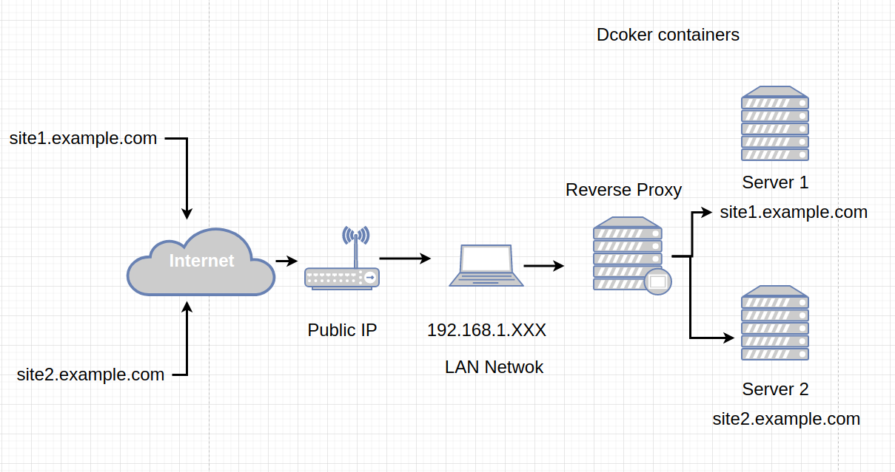
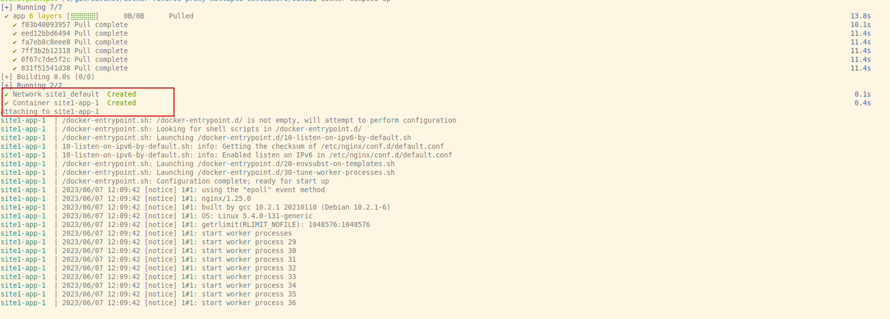
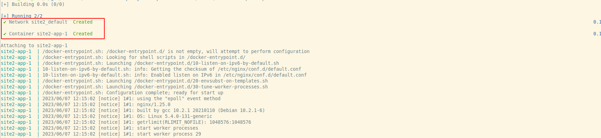
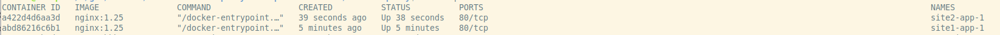
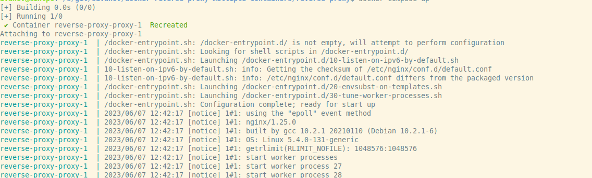
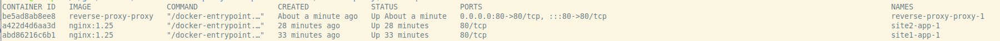
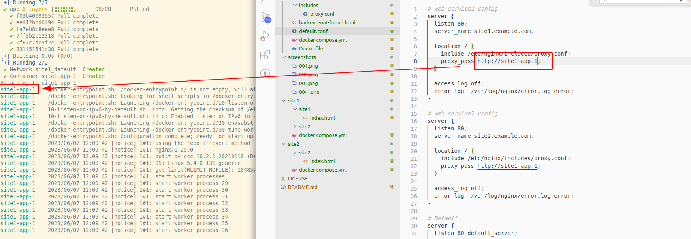

# docker-reverse-proxy-multiple-containers
Docker Compose(new version) Nginx Reverse Proxy with Multiple Containers



Version used in this example
- Docker Compose version v2.18.1
- nginx:1.25 Released 23 May 2023 https://hub.docker.com/_/nginx


Notice docker-compose no longer receives updates 
More info: https://docs.docker.com/compose/migrate/

to instal last version of docker compose:
```
sudo apt update
sudo apt-get install docker-compose-plugin
docker compose version
```

Optional step: Upgrade docker version
```
docker version
sudo apt update
curl -fsSL https://get.docker.com -o get-docker.sh
sudo sh get-docker.sh
```
check version and release data:
```
docker version
```
output
```
Client: Docker Engine - Community
 Version:           24.0.2
 API version:       1.43
 Go version:        go1.20.4
 Git commit:        cb74dfc
 Built:             Thu May 25 21:52:17 2023
 OS/Arch:           linux/amd64
 Context:           default

Server: Docker Engine - Community
.........
```

clone this repo:
```
git clone https://github.com/sivanov/docker-reverse-proxy-multiple-containers.git
cd docker-reverse-proxy-multiple-containers
```

build and run images:
```sh
cd site1
docker compose up
```


open new terminal and navigate to dir with site2:
```
cd site2
docker compose up
```



check if 2 containers are running:


now is time to start reverse proxy container
```
cd reverse-proxy
docker compose build
```


```
docker compose up
```


How looks all runing containers:
```
docker ps
```



now it time to check if domains works 
check you LAN IP :
```
ip a | grep '192.168.'
```
example output:
```
inet 192.168.1.206/24 brd 192.168.1.255 scope global noprefixroute ens33
```


edit virtual hosts in Linux
```
sudo vim /etc/hosts
```

and add this new lines :
```
192.168.1.206 site1.example.com
192.168.1.206 site2.example.com
```

How proxy pass works inside config file:


Now if all work OK is time to replace static websites with your wanted websites